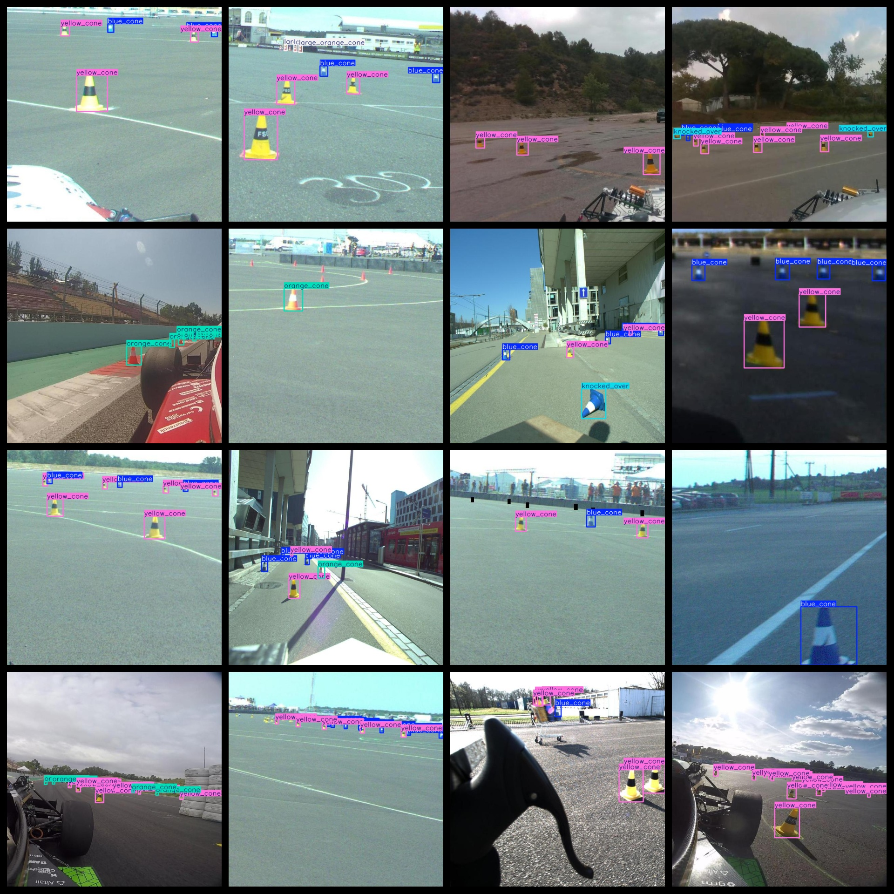
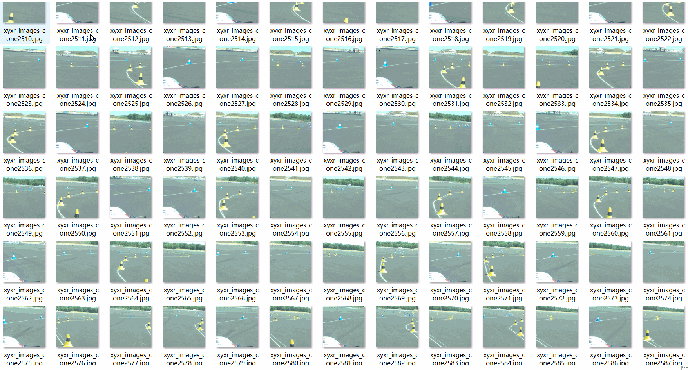

# Cone Shaped bucket Dataset 23826 imagesVOC+YOLO format

Taper Bucket Dataset 23826 sheets VOC + YOLO format

Dataset format: Pascal VOC format + YOLO format (the txt file does not contain the split path, it only contains jpg images and corresponding VOC format xml files and yolo format txt files)

Number of images (number of jpg files): 23826

Number of xml files: 23826

Number of txt files: 23826

Number of categories: 6

The Github repository is: datasets_sl

["blue_cone", "knocked_over", "large_orange_cone", "orange_cone", "unknown_cone", "yellow_cone"]

Number of boxes labeled in each category:

blue_cone number of boxes = 68001 （blueColor Cone body）

knocked_over number of boxes = 1688 （fall down of ）

large_orange_cone frame count = 7180 (large orange cone)

Orange_cone frame count = 22122 (orange cone)

The unknown cone has 450 frames (unknown cone).

The number of yellow cones = 74966

Total Frames: 174,407

Number of images per category:

Blue Cone has 17849 images.

Knocked_over _ count = 772

The number of large_orange_cone pictures is 3380.

Orange_cone occupies a picture number = 6035

Undefined Cone occupies 132 images.

Yellow Cone occupies 16665 pictures.

Image resolution: 640x640

Use the labeling tool: labelImg

Dataset Augmentation: No

Rules for annotation: Draw a rectangle around the category.

Important note: The dataset does not have been divided into training, validation, and testing sets.

Special Disclaimer: This dataset does not guarantee the accuracy of the trained models or weight files.

Annotation and image details are as follows:

## Images

---

Here is a pay link on Stripe (https://buy.stripe.com/3cs8yP7sY87d0vu9AB). Please contact me lonlonago@foxmail.com after funding $89, and I will send you a complete data files, thank you!

